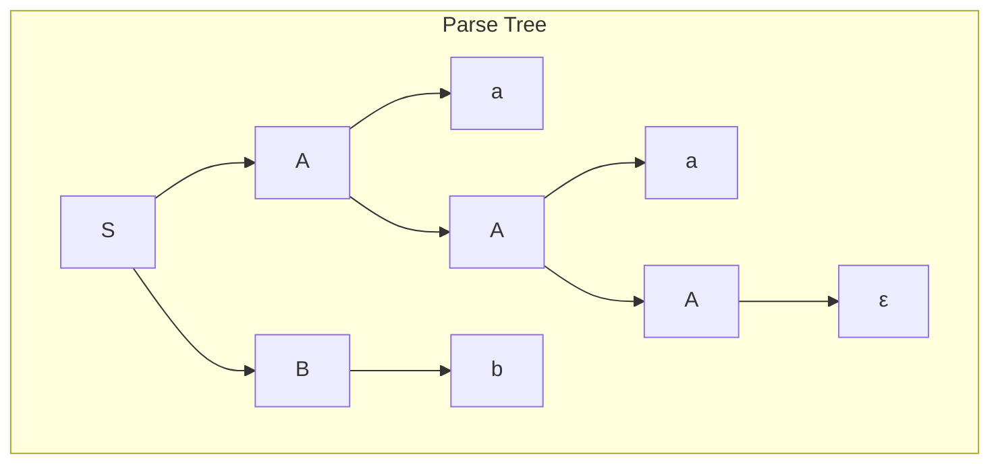

# parse-tree
Let’s solve it step by step, exactly the way it’s expected in compiler design / parsing
(Problem-solving): Grammar: S → AB A → aA | ε B → bB | b Construct the parse tree for "aab".
📘 Given Grammar
S → A B
A → aA | ε
B → bB | b

🎯 Input String
"aab"

🔍 Step 1: Understand the Grammar
Non-terminals

S → Start symbol

A → Generates zero or more a

B → Generates one or more b

Language of Grammar
a* b+

✔ "aab" matches:

aa → from A

b → from B

🔁 Step 2: Derivation (Leftmost)

We derive "aab" from S.

S
⇒ AB
⇒ aA B          (A → aA)
⇒ aaA B         (A → aA)
⇒ aaε B         (A → ε)
⇒ aa B
⇒ aa b          (B → b)

✔ Final string: aab

              
🌳 Step 3: Parse Tree Construction
Hierarchical Structure
        

  

🧠 Explanation of Tree

S splits into A and B

A recursively generates:

first a

second a

then stops with ε

B generates a single b

✅ Final Yield (Leaves Read Left → Right)
a  a  b

✔ Matches input string "aab"
